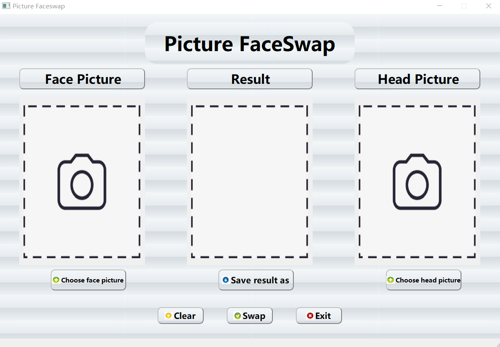
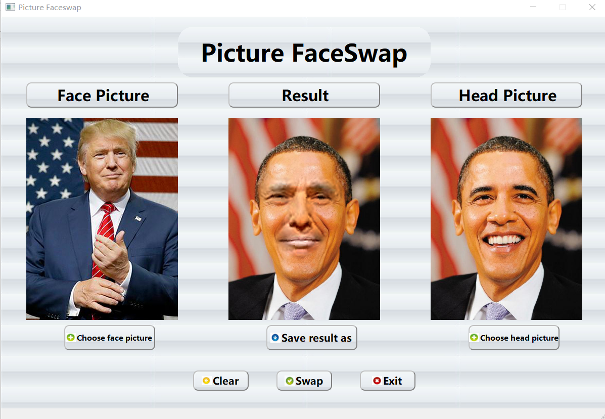
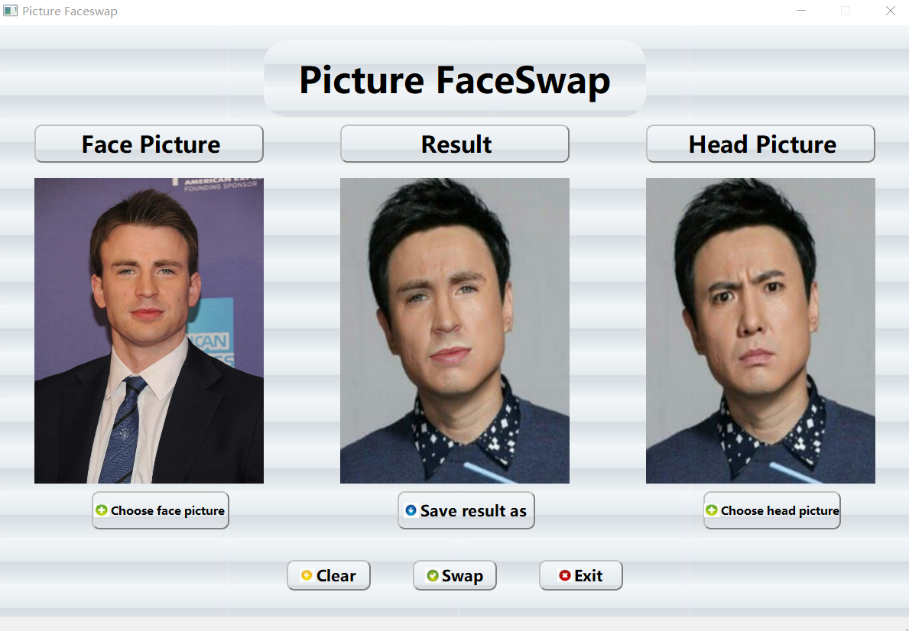
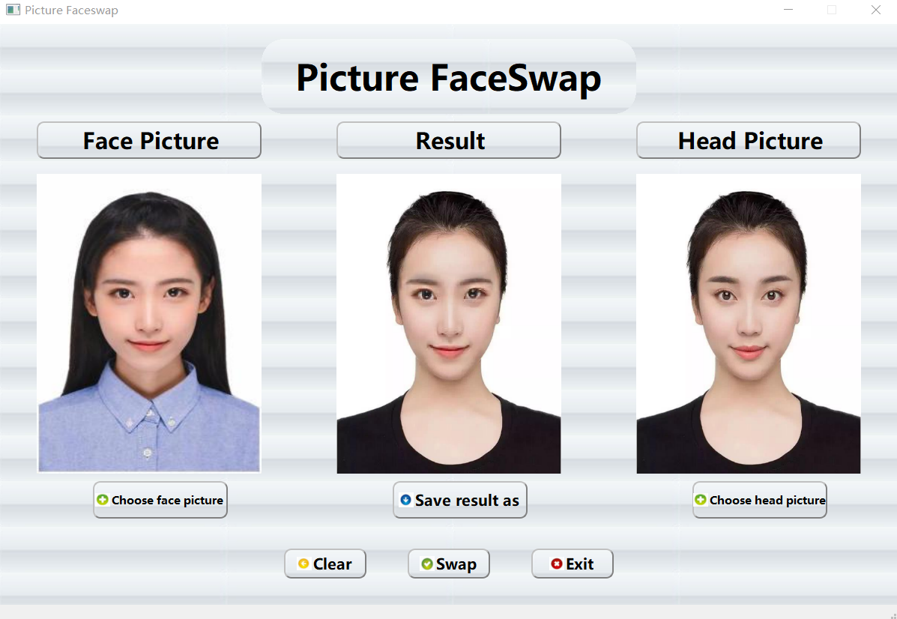
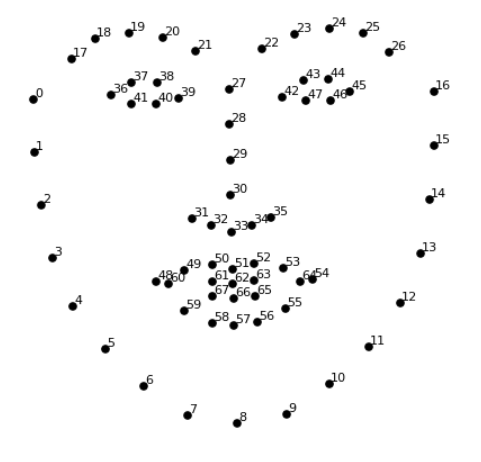

# 智能换脸软件

## 基本信息介绍

### 软件名称

软件名称是Picture Faceswap，表示图片换脸，是一款图片换脸软件。

### 软件功能

已知一幅A的人脸图像，新输入一张B的人脸图像，按下换脸键后，将A的图像自动地换成B的人脸。

### 软件使用说明

#### 软件运行依赖库

OpenCV、dlib、PyQt5、numpy、PIL等库

#### 软件使用步骤

运行指令：python main.py

1. 首先按下 **“Choose face picture”** 和 **“Choose head picture”** 键选择脸部图像和头部图像；
2. 然后按下 **“Swap”** 键进行换脸，换脸后的图像会在 **“Result”** 框图中展现；
3. 按下 **“Save result as”** 可以保存换脸后的图片；
4. 按下 **“clear”** 键会清除所有的图片；
5. 按下 **“Exit”** 键退出软件。

### 界面



### 效果

**测试结果1：**



**测试结果2：**



**测试结果3：**



### 关键程序和算法

1. 获取图像中的面部特征点：
2. 获取人脸遮罩；
3. 获取仿射变换矩阵；
4. 利用仿射变换将脸部图像遮罩映射到头部图片中，得到符合头部图片坐标的新的脸部图像遮罩；
5. 利用仿射变换将脸部图像映射到头部图片中；
6. 修正由于图像肤色和光线的不同导致脸部覆盖区域边缘的不连续问题；
7. 将两个图像的人脸遮罩进行结合；
8. 输出换脸图像。

其中1、2为人脸图像检测部分，3、4、5、6、7、8为人脸图像转换部分

**1.获取图像中的面部特征点：**

```py
# 提取图像中的面部特征点，将图像转换为一个矩阵数组，矩阵中每个元素对应每一行的一个x，y坐标
def acquire_landmarks(image):
    # 首先从dlib库中获取一个人脸检测器
    detector = dlib.get_frontal_face_detector()
    # 然后利用这个人脸检测器对图像画人脸框，返回的是一个人脸检测矩形框的4点坐标
    faces = detector(image, 1)

    # 如果检测器检测到人脸的个数为0，说明图像没有人脸，抛出一个异常
    if len(faces) == 0:
        raise ZeroFaces
    # 如果检测器检测到人脸的个数大于1，说明图像中不止一个人脸，抛出一个异常
    if len(faces) > 1:
        raise MoreThanOneFaces

    # 从dlib库中通过已经预训练好的关键点模型，返回一个人脸关键点预测器，用来标记人脸关键点
    predictor = dlib.shape_predictor("./predictor.dat")
    
    # 定位人脸关键点，faces[0]是开始内部形状预测的边界框，最后返回关键点的位置
    shape = predictor(image, faces[0])
    matrix = numpy.matrix([[point.x, point.y] for point in shape.parts()])
    return matrix
```

首先可以从dlib库中下载一个预训练模型，以此构建特征提取器，dlib库中获取的人脸检测器能够获取人脸的一个边界框矩形列表，每个矩形列表代表一个人脸，并作为特征提取器的输入最后返回特征点矩阵，每个特征点对应图像的一个x，y坐标。

**2.获取人脸遮罩：**

```py
# 得到人脸遮罩
def acquire_shade(image, landmarks):
    shape = image.shape[:2]
    image = numpy.zeros(shape, numpy.float64)

    # 获取dlib库中识别眉毛和眼睛的识别点区域
    brow_and_eye_points = list(range(17, 48))
    # 获取dlib库中识别鼻子和嘴巴的识别点区域
    nose_and_mouth_points = list(range(27, 35)) + list(range(48, 61))

    # 利用OpenCV库中convexHull函数得到眉毛和眼睛的凸包，从而得到眉毛和眼睛的轮廓
    brow_and_eye_landmarks = cv2.convexHull(landmarks[brow_and_eye_points])
    # 得到鼻子和嘴巴的凸包，从而得到鼻子和嘴巴的轮廓
    nose_and_mouth_landmarks = cv2.convexHull(landmarks[nose_and_mouth_points])

    # 填充眉毛和眼睛、鼻子和嘴巴的轮廓
    cv2.fillConvexPoly(image, brow_and_eye_landmarks, 1)
    cv2.fillConvexPoly(image, nose_and_mouth_landmarks, 1)

    # 将矩阵转换为图像表示
    image = numpy.array([image, image, image]).transpose((1, 2, 0))
    
    # 使用高斯滤波对图像进行降噪处理
    plume_amount = 11
    # 画出的两个区域的轮廓向遮罩的边缘外部羽化扩展plume_amount个像素，可以隐藏不连续的区域
    image = (cv2.GaussianBlur(image, (plume_amount, plume_amount), 0) > 0) * 1.0
    return cv2.GaussianBlur(image, (plume_amount, plume_amount), 0)
```

在用dlib的库检测人脸的特征点时，可以得到一个由68个点组成的映射，将这些映射组合起来，可以识别人脸的不同的部位：



可以看到，其中：

+ 点42~47对应左眼；
+ 点36~41对应右眼；
+ 点22~26对应左眼眉毛；
+ 点17~21对应右眼眉毛；
+ 点27~34对应鼻子；
+ 点48~60对应嘴巴。

那么，遮罩要用到的区域由两个区域组成，分别是由眉毛和眼睛组成的区域，以及鼻子和嘴巴组成的区域，识别区域分别为点17 ~ 47和点27 ~ 34、48 ~ 60，最后识别出的区域由这两个区域构成，点为17 ~ 60。

**3.获取仿射变换矩阵：**

```py
# 获取仿射变换矩阵
def acquire_aff_tra_matrix(head_landmarks, face_landmarks):
    # 获取要转换的识别点区域
    head_landmarks = head_landmarks[list(range(17, 61))]
    face_landmarks = face_landmarks[list(range(17, 61))]

    # 先将获取到的头部特征点矩阵的数字类型转换为浮点数，以得到更精确的列均值
    head_landmarks = head_landmarks.astype(numpy.float64)
    # 对矩阵的各列求均值，得到各列均值，即矩心
    col_aver1 = numpy.mean(head_landmarks, 0)
    # 按照普式分析法，各列减去矩心
    head_landmarks = head_landmarks - col_aver1
    # 对矩阵的各列求标准差，得到各列的标准差
    SD1 = numpy.std(head_landmarks)
    # 各列除以标准差，按照标准差缩放，减少了有问题的组件的缩放偏差
    head_landmarks = head_landmarks / SD1

    # 获取到的脸部特征点矩阵也按照上面的过程处理
    face_landmarks = face_landmarks.astype(numpy.float64)
    col_aver2 = numpy.mean(face_landmarks, 0)
    face_landmarks = face_landmarks - col_aver2
    SD2 = numpy.std(face_landmarks)
    face_landmarks = face_landmarks / SD2

    col_aver1 = col_aver1.T
    col_aver2 = col_aver2.T
    SD_div = SD2 / SD1 * 1.0

    # 使用奇异值分解计算旋转部分，返回三个矩阵，分别为左奇异值、奇异值、右奇异值
    head_landmarks_tra = head_landmarks.T
    u, s, vh = numpy.linalg.svd(head_landmarks_tra * face_landmarks)

    # 公式假设矩阵在右边，有行向量，解决方案要求矩阵在左边，有列向量，所以进行转置
    R = u * vh
    R = R.T

    # 返回根据普式分析法得到的仿射变换矩阵
    return numpy.vstack([numpy.hstack((SD_div * R, col_aver2 - SD_div * R * col_aver1)), numpy.matrix([0., 0., 1.])])
```

得到了脸部图片和头部图片的两个面部特征点矩阵之后，需要确定一个对应关系，使脸部特征点的向量通过映射转换之后得到的新向量与头部特征点的向量尽可能相似，这样人脸图像迁移时才会更加准确，转换为数学问题就是，寻找一个标量s，二维向量T，正交矩阵R，使：

$\sum\limits_{i=0}^n||sR\mathbf{p_i} + T - \mathbf{q_i}||^2 (n = 67)$

表达式结果最小（$p_i$和$q_i$是两个面部特征点矩阵的第i行）。

可以通过普式分析法来解决这类问题，通过减去质心，按标准差缩放，然后使用奇异值分解计算旋转得到仿射变换矩阵[s * R | T]，从而解决这一问题。

**4、5.仿射变换映射图片：**

```py
def warpAffine_face(face_image, aff_tra_matrix, head_image):
    warpAffine_image = numpy.zeros(head_image.shape, face_image.dtype)
    width = head_image.shape[1]
    height = head_image.shape[0]
    cv2.warpAffine(face_image, aff_tra_matrix[:2],
                   (width, height), warpAffine_image,
                   borderMode=cv2.BORDER_TRANSPARENT,
                   flags=cv2.WARP_INVERSE_MAP)
    return warpAffine_image
```

**6.修正图像边缘函数：**

```py
# 修正由于图像肤色和光线的不同导致脸部覆盖区域边缘的不连续问题
def revise_edge(head_image, face_image, head_landmarks):
    # 取左眼的识别点矩阵的矩心
    left_eye_points_col_aver = numpy.mean(head_landmarks[list(range(42, 48))], 0)
    # 取右眼识别点矩阵的矩心
    right_eye_points_col_aver = numpy.mean(head_landmarks[list(range(36, 42))], 0)
    # 取两个矩心之差，取范数后乘以一个模糊量系数得到一个为奇数的高斯内核
    eye_points_col_aver_sub = left_eye_points_col_aver - right_eye_points_col_aver
    blur_fra = 0.6
    kernel_size = int(blur_fra * numpy.linalg.norm(eye_points_col_aver_sub)) + 1
    if kernel_size % 2 == 0:
        kernel_size = kernel_size - 1
    # 使用高斯滤波函数得到两个图像的高斯模糊值
    head_image_blur = cv2.GaussianBlur(head_image, (kernel_size, kernel_size), 0)
    face_image_blur = cv2.GaussianBlur(face_image, (kernel_size, kernel_size), 0)
    face_image_blur = face_image_blur + 128 * (face_image_blur <= 1.0)
    
    # 将使用到的值都转换为float64类型的
    face_image = face_image.astype(numpy.float64)
    head_image_blur = head_image_blur.astype(numpy.float64)
    face_image_blur = face_image_blur.astype(numpy.float64)

    # 使用脸部图片乘以头部图片模糊值，再除以脸部图片模糊值，得到修正边缘后的图像
    return face_image * head_image_blur / face_image_blur
```

可以通过改变脸部图像的颜色，用RGB缩放颜色，使其更加接近面部头像，从而解决边缘问题，这里使用了一个模糊算法，通过一个模糊系数乘以两眼之间的距离作为高斯内核，得到两个图像的高斯模糊值，然后用脸部图像乘以头部图像的高斯模糊值，再除以脸部图像的高斯模糊值，返回修正边缘后的图像。

**7、8.和“Swap”按钮相关联的换脸进行过程：**

```py
# 进行换脸然后显示结果
def swapFace(self):
    _translate = QtCore.QCoreApplication.translate
    # 如果没有选择脸部图片或头部图片，那么不换脸
    if self.FACE_PICTURE_PATH == "" or self.HEAD_PICTURE_PATH == "":
        self.resultLabel.setStyleSheet("border-image:url(./icons/initial2.png);")
        self.resultLabel.setText(_translate("MainWindow", "<html><head/><body><p align=\"center\"><span style=\" font-size:20pt; font-weight:600;\">Please choose<br>Face first!</span></p></body></html>"))
        return

    try:
        # 初始化中间的结果图片框
        self.resultLabel.setText(_translate("MainWindow", "<html><head/><body><p align=\"center\"><span style=\" font-size:20pt; font-weight:600;\"></span></p></body></html>"))
        # 根据图像的路径名读入图像，将图像转为3通道BGR彩色图像
        head_image = cv2.imread(self.HEAD_PICTURE_PATH, cv2.IMREAD_COLOR)
        face_image = cv2.imread(self.FACE_PICTURE_PATH, cv2.IMREAD_COLOR)
        # 获取头部图片遮罩和脸部图片遮罩
        headshade = acquire_shade(head_image, head_landmarks)
        faceshade = acquire_shade(face_image, face_landmarks)
        # 获取仿射变换矩阵
        aff_tra_matrix = acquire_aff_tra_matrix(head_landmarks, face_landmarks)
        # 利用仿射变换将脸部图像遮罩映射到头部图片中，生成符合头部图片坐标的新脸部遮罩
        warpAffine_shade = warpAffine_face(faceshade, aff_tra_matrix, head_image)
        # 利用仿射变换将脸部图像映射到头部图片中
        warpAffine_image = warpAffine_face(face_image, aff_tra_matrix, head_image)
        # 得到修正边缘之后的图像
        revise_edge_image = revise_edge(head_image, warpAffine_image, head_landmarks)
        # 将符合头部照片的新的脸部图片遮罩和头部图片遮罩结合为一个，尽可能表现出头部图片遮罩的特性
        combined_shade = numpy.max([headshade, warpAffine_shade], 0)
        # 应用遮罩，输出换脸图像
        result_image = head_image * (1.0 - combined_shade) + revise_edge_image * combined_shade
        # 在缓存文件夹中保存换脸图片
        cv2.imwrite("./tmp/tmp_result.png", result_image)
        # 设置换脸图片
        self.resultLabel.setStyleSheet("border-image:url(./tmp/tmp_result.png);")
        # 记录图片路径
        self.RESULT_PICTURE_PATH = "./tmp/tmp_result.png"
    # 捕捉多于一个人脸的异常
    except MoreThanOneFaces:
        _translate = QtCore.QCoreApplication.translate
        self.resultLabel.setStyleSheet("border-image:url(./icons/initial2.png);")
        self.resultLabel.setText(_translate("MainWindow", "<html><head/><body><p align=\"center\"><span style=\" font-size:24pt; font-weight:600;\">More than<br>One faces!</span></p></body></html>"))
        self.RESULT_PICTURE_PATH = ""
    # 捕捉没有人脸的异常
    except ZeroFaces:
        _translate = QtCore.QCoreApplication.translate
        self.resultLabel.setStyleSheet("border-image:url(./icons/initial2.png);")
        self.resultLabel.setText(_translate("MainWindow", "<html><head/><body><p align=\"center\"><span style=\" font-size:30pt; font-weight:600;\">Zero<br>Face!</span></p></body></html>"))
        self.RESULT_PICTURE_PATH = ""
```
